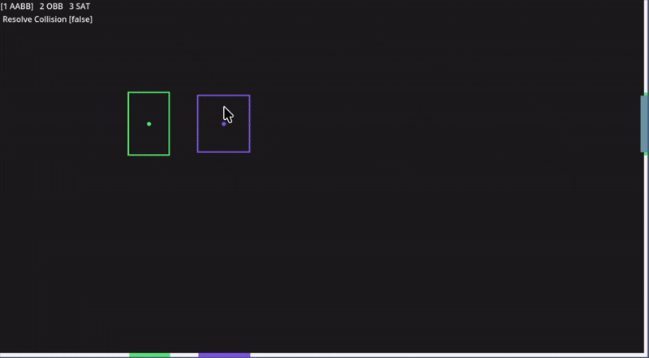
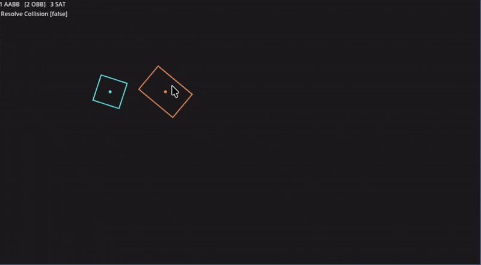
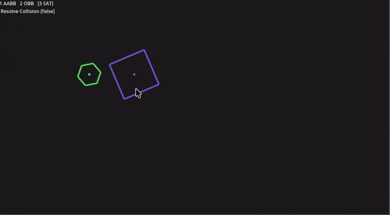
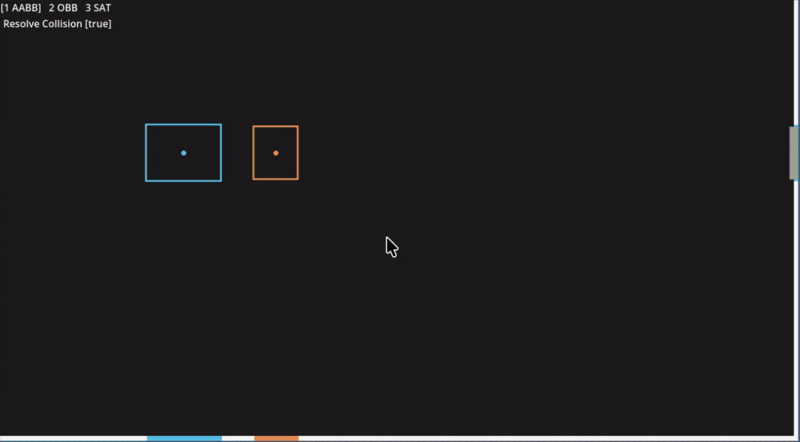
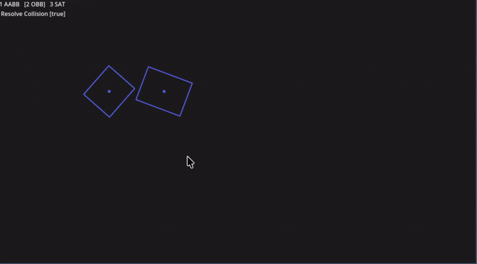

# Physicsim

## Convex polygon collision detection and resolution.
This project is a simple physics simulation that demonstrates convex polygon collision detection and resolution.

## Controls
- "1" go to AABB scene
- "2" go to OBB scene
- "3" go to SAT scene
- "Space" switch collision resolution

### AABB
Axis-Aligned Bounding Box (AABB) is a simple bounding volume used in collision detection. It is defined by two points: the minimum and maximum corners of the box. AABBs are easy to compute and can be used for broad-phase collision detection to quickly eliminate pairs of objects that are not colliding.

### OBB
Oriented Bounding Box (OBB) is a bounding volume that can be rotated to fit the shape of the object more closely than an AABB. OBBs are defined by a center point, half-extents, and an orientation. They provide a tighter fit around objects, which can lead to more accurate collision detection.

### SAT
The Separating Axis Theorem (SAT) is a method used to determine if two convex shapes are intersecting. It states that if there exists a line (axis) on which the projections of the two shapes do not overlap, then the shapes are not colliding. SAT is commonly used for collision detection between convex polygons, including AABBs and OBBs.

### Collision Resolution
Collision resolution is the process of responding to a detected collision by adjusting the positions and velocities of the colliding objects to prevent them from interpenetrating. This typically involves calculating the collision normal, penetration depth, and applying impulses to the objects to separate them and simulate realistic physical interactions.

#### AABB

#### OBB

#### SAT

